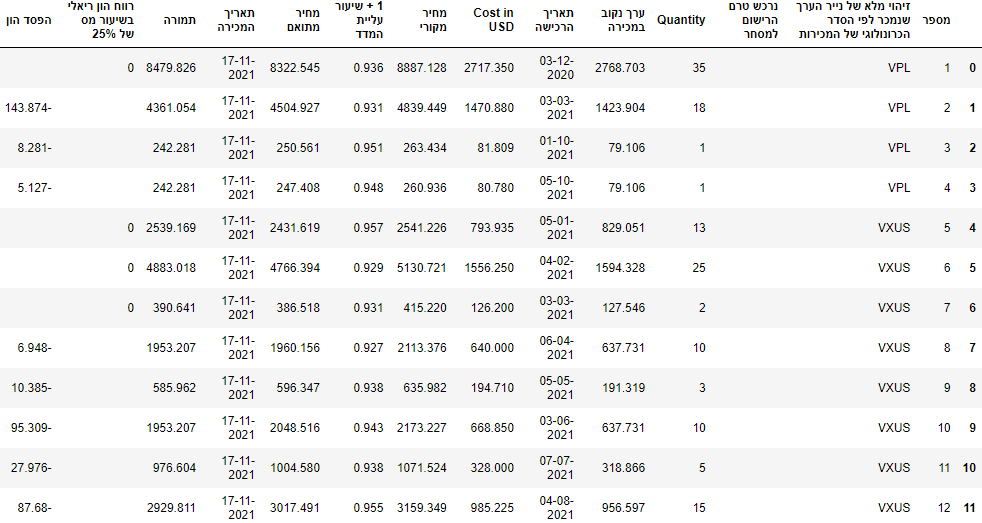
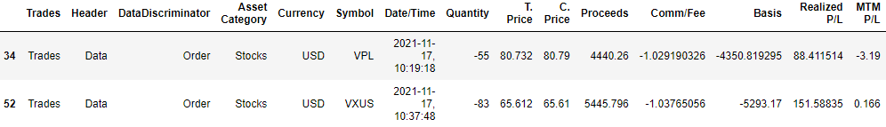

# The IsraeliTaxReport class
This class is intended to assist with filling out an Israeli annual tax report for Israelis who own stocks in a US brokerage account from which taxes are not automatically paid upon sells of stocks and therefore need to be reported. Currently, it can only handle a report from [Interactive Brokers](https://www.interactivebrokers.com/en/home.php) data, but the class can quite easily be edited to handle other formats of raw data by editting its 'keywords' attribute. 
    
The main method, 'form1325', outputs the lines of form '1325', which is the main form used to report taxable trades (and is not trivial to generate directly from the broker report). The class has other useful attributes for the tax report, such as 'ustax_paid_df', which contain the taxes paid in the us (usually due to dividends).

Most of the attributes are Pandas dataframes. This class is not optimized for speed but for ease of reading and submitting tax report data (typically done once or twice a year).

Read more about submitting the Israeli tax report (in Hebrew) [here](https://fintranslator.com/israel-tax-return-example-2019/).

#### Requirements:
```Python
currency_converter==0.5.5
CurrencyConverter==0.16.7
pandas==1.3.5
```

## Instructions for using the IsraeliTaxReport class

### [1] Obtain the raw report from Interactive Brokers as a .csv file:
* On your Interactive Brokers page, go to **Performance & Statements** and under **Reports**, choose **Statements**


* Create a **Custom Statement**


* Under **Sections**, choosing the following is currently sufficient:


* **Section Configurations** can be left as the default.

* **Delivery Configurations** - choose Format: CSV, Period: Daily, Language: English.

* Now you can run the statement, which is saved under **Custom Statements**.

* **ATTENTION:** Customs statements on Interactive Brokers can be generated for a maximum period of 1 year. However, this might not be sufficient for the calculation of form '1325' for the tax year of interest, as stocks bought on another year may have been sold. In such a case, you may need to combine several .csv files to obtain all the data needed. Otherwise, the report will still be generated, but include only partial data. To understant more, read about the [FIFO method](https://www.investopedia.com/terms/a/averagecostbasismethod.asp#:~:text=FIFO,purchasing%2030%20shares%20in%20April.) for calculating returns and losses from selling stocks.

### [2] To instantiate the IsraeliTaxReport class (in the same directory as IsraeliTaxReport.py):

```Python
from IsraeliTaxReport import IsraeliTaxReport

csv_name = 'sample_custom_statement.csv'  # This is the custom statement generated in Interactive Brokers
report = IsraeliTaxReport(csv_name)
```

### [3] The 'form1325' method:
Returns a Pandas dataframe corresponding to the Israeli tax form '1325'. Assumes that relevant data (buy & sell orders) is found in .csv used by class.
If ```save_as_csv=True```, also saves the output as a .csv file that can be used (almost as is) in place of form '1325' for the yearly tax report. Read more about submitting the Israeli tax report [here](https://fintranslator.com/israel-tax-return-example-2019/). The 'official' form 1325 can be seen [here](https://www.gov.il/blobFolder/service/annual-tax-report-2019/he/Service_Pages_Income_tax_itc1325-2019.pdf).
```Python
form1325 = report.form1325(year='2021', save_as_csv=True)
```
Example output dataframe (generated for ```sample_custom_statement.csv```):



### [4] Attributes:
* The values of the ```keywords``` dictionary can be changed to fit the format of .csv statements provided by other brokers.
```Python
report.keywords = {'trades': 'Trades',
                   'stocks': 'Stocks',
                'dividends': 'Dividends',
                     'date': 'Date/Time',
                   'symbol': 'Symbol',
                 'quantity': 'Quantity',
                    'basis': 'Basis',
               'asset type': 'Asset Category',
                'data type': 'DataDiscriminator',
              'US tax paid': 'Withholding Tax',
                    'order': 'Order',
              'cash report': 'Cash Report',
                   'amount': 'Amount'}
```

* The [Currency Converter](https://pypi.org/project/CurrencyConverter/) is used for conversion between USD and ILS. ```report.converter``` is an instance of this class.

* By default, ```report.forex = 'USD'``` and ```report.base_currency = 'ILS'```.

* ```report.trades_df```, ```report.stocks_df```,  ```report.stock_sells_df```, and ```report.stock_buys_df``` are dataframes cotaining all trades, stock trades, stock sell orders, and stock buy orders, respectively. For example, for ```sample_custom_statement.csv```, the output dataframe of ```report.stock_sells_df``` is


