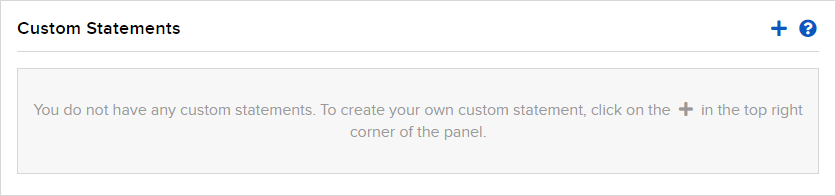

# Instruction for using the IsraeliTaxReport class

### [1] Obtain the raw report from Interactive Brokers as a .csv file:
* On your Interactive Brokers page, go to **Performance & Statements** and under **Reports**, choose **Statements**


* Create a **Custom Statement**



* Under **Sections**, choosing the following is currently sufficient:


* **Section Configurations** can be left as the default.
* **Delivery Configurations** - choose Format: CSV, Period: Daily, Language: English.
* Now you can run the statement, which is saved under **Custom Statements**.

### [2] To instantiate the IsraeliTaxReport class (in the same directory as IsraeliTaxReport.py):

```
csv_name = 'custom_statement.csv'  # This is the custom statement generated in Interactive Brokers
from IsraeliTaxReport import IsraeliTaxReport
report = IsraeliTaxReport(csv_name)
```

